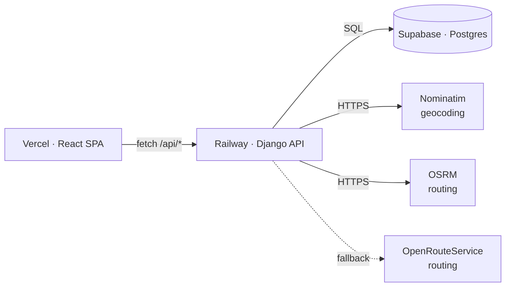

# ELD Trip Planner — Backend

Django + DRF API for the FMCSA HOS-compliant trip planner. Pairs with the
sibling frontend repo (`eld-trip-planner` — React 19 + MUI, deployed to Vercel).

## Live URLs

- API: _TBD (Railway)_
- Frontend: _TBD (Vercel)_

## Architecture



## Stack

- Python 3.12, Django 5.x, Django REST Framework
- PostgreSQL (Supabase) via `psycopg[binary]`
- `uv` for dependency management
- `pytest` + `pytest-django` for tests
- `gunicorn` + `whitenoise` for production serving

## Local setup

```bash
# 1. Install dependencies
uv sync

# 2. Configure environment
cp .env.example .env
# edit .env — at minimum set DJANGO_SECRET_KEY and DATABASE_URL

# 3. Apply migrations
uv run python manage.py migrate

# 4. Run the dev server
uv run python manage.py runserver
```

Run tests with `uv run pytest`.

## Deployment (Railway)

The repo ships with [`railway.json`](railway.json) so a Railway service deploys
with no UI tweaks beyond setting environment variables.

1. Push this repo to GitHub.
2. In Railway, **New Project → Deploy from GitHub repo** and select this repo.
3. Set the env vars below in the service's **Variables** tab.
4. Generate a public domain — Railway sets `RAILWAY_PUBLIC_DOMAIN` automatically
   and `settings.py` appends it to `ALLOWED_HOSTS` and `CSRF_TRUSTED_ORIGINS`.

What `railway.json` does:

- **Build:** uses the repo's [`Dockerfile`](Dockerfile) (Python 3.12-slim
  + uv 0.5.11 pinned via `ghcr.io/astral-sh/uv`). The image runs
  `uv sync --frozen --no-dev` and `collectstatic` so Whitenoise can serve
  the admin's static assets out of `staticfiles/`.
- **Start:** `migrate --noinput` then `gunicorn config.wsgi:application` on
  `$PORT` with 2 workers and access logs on stdout.
- **Health check:** `/api/health/` (100 s timeout) — Railway only routes
  traffic once it returns `{"ok": true}`.
- **Restart policy:** on failure, up to 10 retries.

We use a Dockerfile rather than Nixpacks because Nixpacks' uv provider
shells out `pip install uv==$NIXPACKS_UV_VERSION` and currently fails when
that env var is unset. Pinning uv in the Dockerfile is also more
reproducible.

### Required env vars on Railway

| Variable | Notes |
| --- | --- |
| `DJANGO_SECRET_KEY` | Generate with `python -c 'import secrets; print(secrets.token_urlsafe(50))'` |
| `DEBUG` | `False` in production |
| `DATABASE_URL` | Supabase Postgres connection string (Pooler URI recommended) |
| `CORS_ALLOWED_ORIGINS` | The deployed Vercel origin, e.g. `https://eld-trip-planner.vercel.app` |
| `NOMINATIM_USER_AGENT` | Required by Nominatim TOS — include a contact email |

### Optional env vars

| Variable | Purpose |
| --- | --- |
| `ALLOWED_HOSTS` | Extra hosts. `RAILWAY_PUBLIC_DOMAIN` is auto-appended. |
| `CSRF_TRUSTED_ORIGINS` | Extra origins. The Railway domain is auto-appended. |
| `ORS_API_KEY` | Enables OpenRouteService fallback when OSRM fails or rate-limits |
| `OSRM_BASE_URL` | Override the OSRM host (default: public demo server) |

## Third-party service caveats

- **OSRM public demo** (`router.project-osrm.org`) is rate-limited and not
  guaranteed available. For production traffic, self-host OSRM or rely on the
  OpenRouteService fallback (`ORS_API_KEY`).
- **Nominatim** requires a descriptive `User-Agent` and at most 1 req/sec.
  The geocoding service caches aggressively (in-memory + Django cache) so
  most lookups never hit the upstream.

## Continuous integration

[`.github/workflows/ci.yml`](.github/workflows/ci.yml) runs `pytest` against
every push and PR to `main`, using `uv` with a `uv.lock`-keyed cache. Concurrency
groups cancel superseded runs on the same branch.

## Project layout

```
config/                # Django project (settings, urls, wsgi, asgi, health)
trips/                 # trips app (models, services, serializers, views, tests)
manage.py
pyproject.toml
uv.lock
railway.json           # Railway deploy config
```
